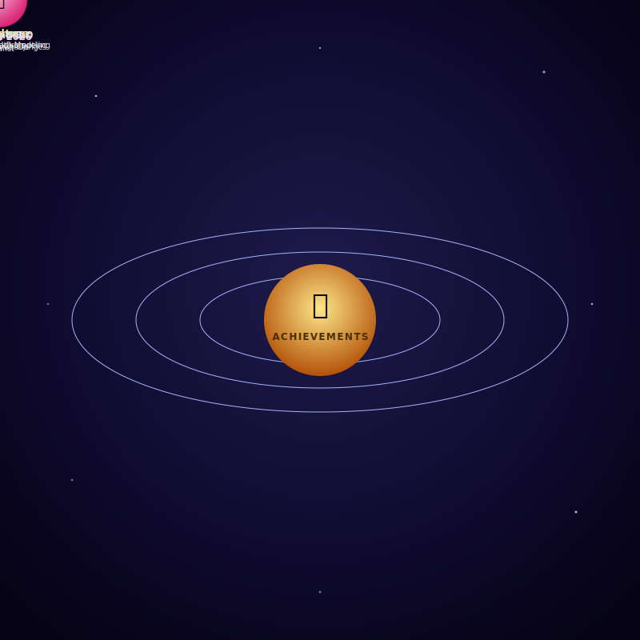

<div align="center">


</div>

## 👋 About Me

 **Computer Engineering student at MIT Academy of Engineering, Pune** (SGPA 8.60), with a passion for **AI-powered, full-stack, and decentralized solutions**. I build intelligent systems that solve real accessibility and rural-ecosystem problems.


```javascript
const rutvik = {
    pronouns: "he/him",
    education: "B.Tech CE @ MIT-AOE Pune",
    codingRule: "clean, scalable, accessibility-first",
    currentFocus: () => console.log("Multi-Agent AI × Blockchain × MERN"),
};
```

---

## 🧰 Technical Arsenal

### 🔤 Languages & Scripting
```python
languages = [
    "Python", "C", "C++", "JavaScript",
    "HTML/CSS", "Dart",                 # mobile
    "NumPy", "Pandas", "Matplotlib"     # data & analysis
]
```

### ⚙️ Full Tech Stack

<table>
<tr>
<td valign="top" width="50%">

**Frontend & Mobile**
```js
const frontend = {
  web: ["HTML/CSS", "JavaScript"],
  mobile: "Flutter (Dart)",
  auth: "Firebase",
};
```

</td>
<td valign="top" width="50%">

**Backend & APIs**
```js
const backend = {
  runtime: "Node.js",
  frameworks: ["Express.js", "FastAPI", "Flask"],
  architecture: "RESTful APIs",
  db: ["MongoDB", "Supabase"],
};
```

</td>
</tr>
<tr>
<td valign="top" width="50%">

**GenAI & Emerging Tech**
```js
const genAI = {
  apis: ["Gemini API", "OpenRouter API"],
  skills: ["System Prompting", "LLM Tutoring"],
  blockchain: ["MetaMask", "Ganache", "EVM"],
};
```

</td>
<td valign="top" width="50%">

**DevOps & Tools**
```js
const tools = {
  containers: "Docker",
  vcs: "Git",
  cloud: ["Firebase", "Supabase"],
};
```

</td>
</tr>
</table>

### 📈 Currently Learning
```yaml
deepening: [Advanced System Prompting, Smart Contract Security]
exploring: [Cross-chain dApps, Multi-Agent Orchestration]
```

### 🖼️ Tech Visualization

<p>


</p>
<p>


</p>

---


## 🏆 Experience & Honors
<div>
  
  
</div>
<br clear="all" />

## 📜 Certifications

```text
✔ Oracle Cloud Infrastructure 2025 — Certified Generative AI Professional
✔ Oracle Cloud Infrastructure 2025 — Certified Foundations Associate
✔ Oracle Cloud Infrastructure 2025 — Certified AI Foundations Associate
✔ Oracle Data Platform 2025      — Certified Foundations Associate
✔ Cisco Networking Academy       — Introduction to Modern AI
```

---

## 🗺️ Learning Roadmap

```json
class Rutvik_Journey {
  currently_mastering: [
    "Advanced Blockchain Security",
    "Multi-Agent Orchestration",
    "Scalable System Design"
  ],
  eager_to_learn: [
    "Docker", "CI/CD Pipelines", "Cloud Architecture"
  ],
  goals: [
    "🎯 Ship production-grade AI + blockchain systems",
    "🌍 Contribute to open-source projects",
    "📚 Master system design & architecture"
  ]
}
```

---
## 📊 GitHub Stats

<p align="center">
  <!--  -->
  
</p>

---

## 📫 Connect with Me

<p align="center">
<a href="mailto:rutvikmhaske720@gmail.com"></a>
<a href="https://linkedin.com/in/rutvik-mhaske-b6b456386/"></a>
<a href="https://github.com/RutvikMhaske720/"></a>
<a href="https://www.instagram.com/mrs_47_369?igsh=OHk0eXptaXVrNmYw"></a>
</p>

**🤝 Open for:** Collaborations · Internship Opportunities · Research · Mentorship

---

<div align="center">

*"Good systems aren't built fast — they're built thoughtfully."*

**Thanks for visiting my profile! 🚀**


</div>
